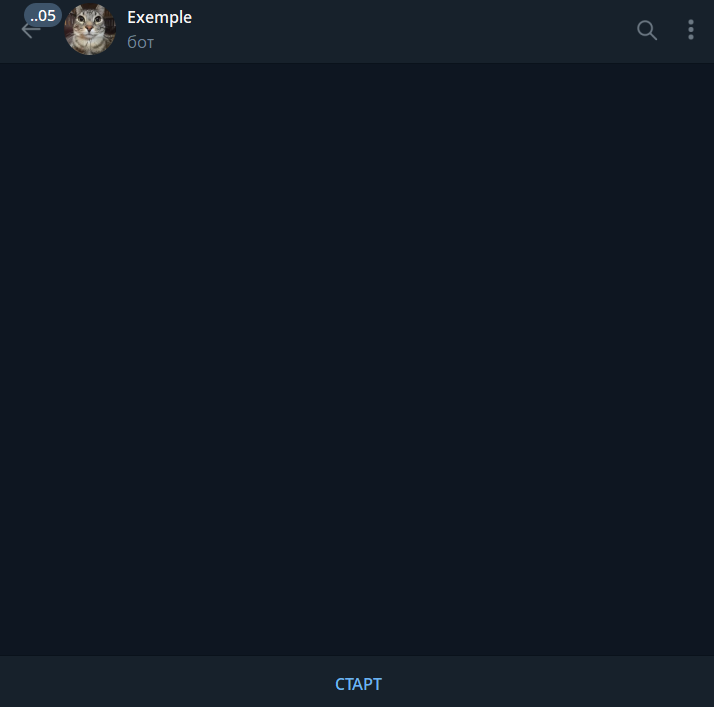
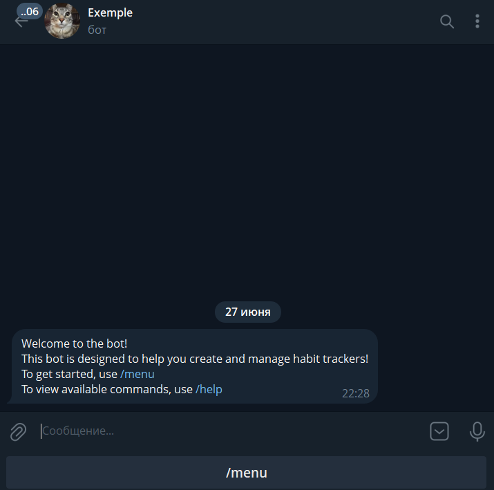
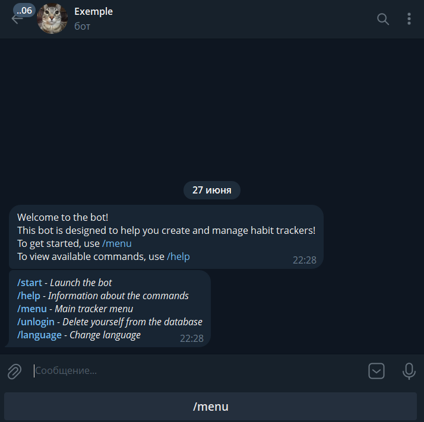
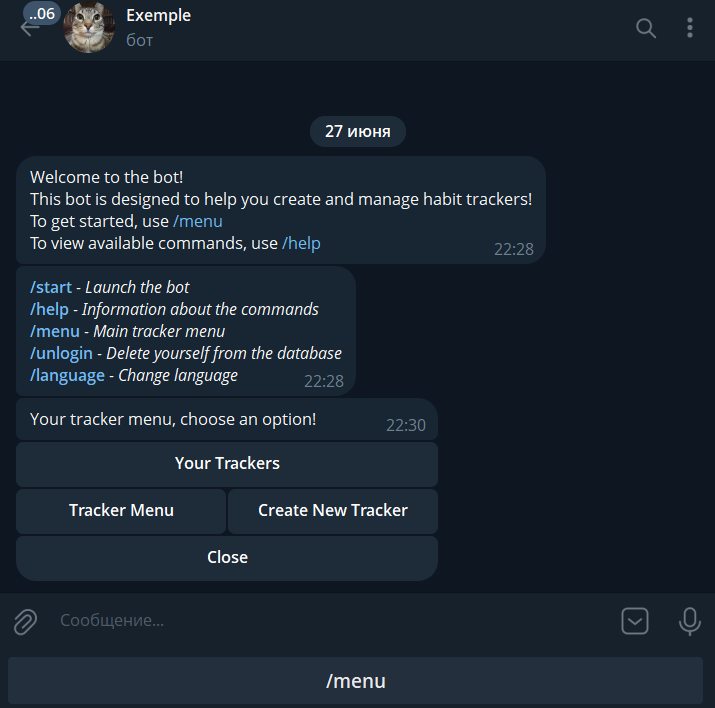
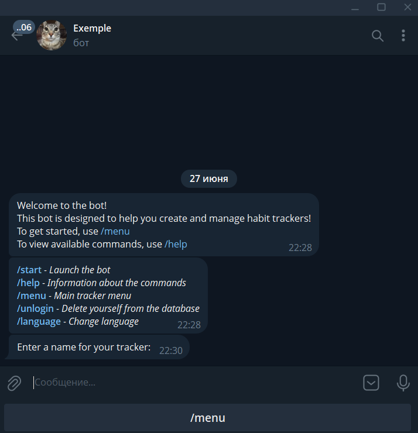
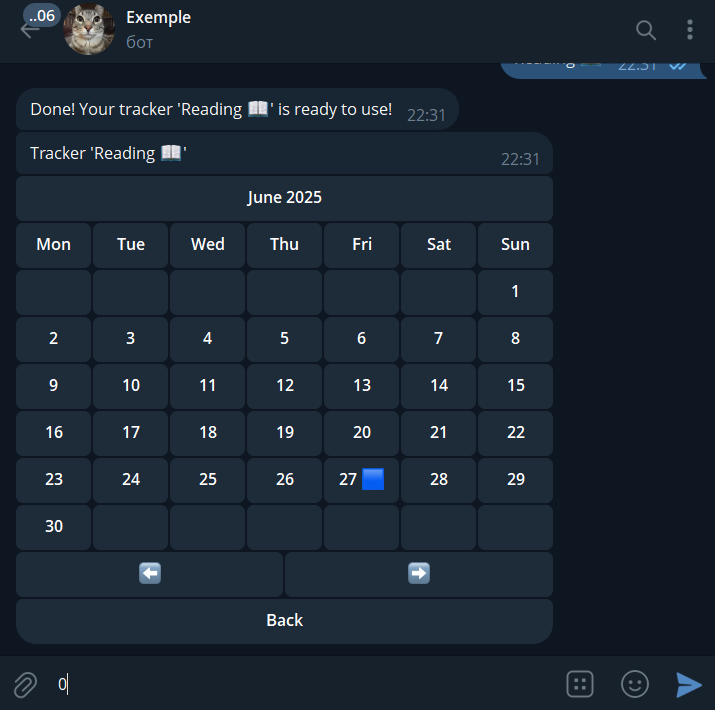
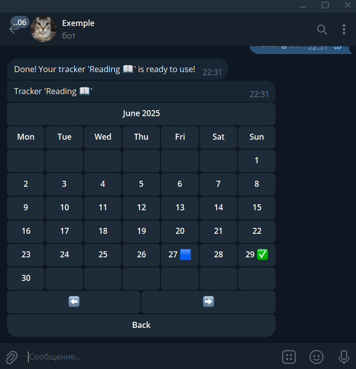
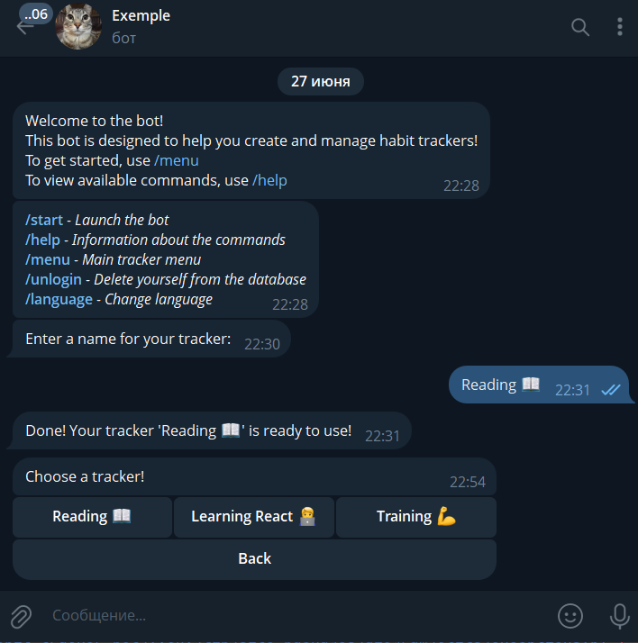
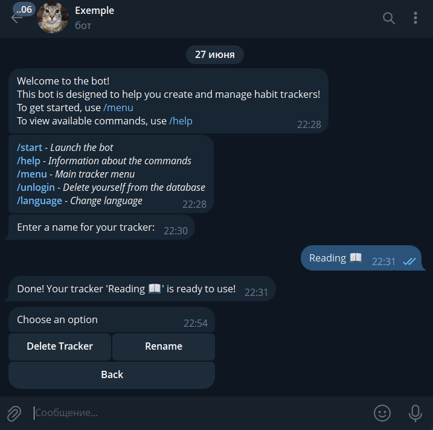
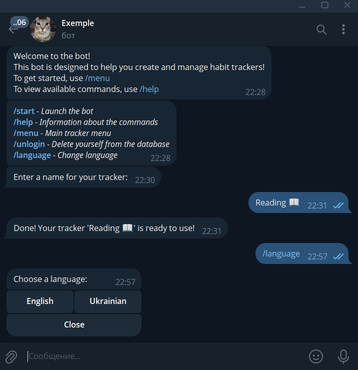

# 📱 Habit Tracker Telegram Bot

A simple and effective Telegram bot that i created in 2023 to help you build and maintain new habits — right from your chat.

---

## ✨ Features

- ✅ **Create personalized habit trackers**
- 📅 **Visualize your progress in an interactive calendar**
- 🔁 **Track and mark daily progress with ease**
- 🛠 **Modify, delete, or reset trackers at any time**
- 🌐 **Automatically adapts to your Telegram language settings** (EN / UA)

---

## 💡 About

This Telegram bot is designed to help you bring new habits into your life.  
You can create custom habit trackers, mark your daily progress, and visualize everything in a clean calendar interface — all within Telegram.

---

## 🚀 Getting Started

1. Create bot via BotFather in Telegram
2. Enter the token in the file `./src/token.py`
3. Start the bot via Telegram
4. Use the command `/start` to begin
5. Follow the guided prompts to create your first habit tracker
6. Track your progress every day and review it in the calendar

---

## 📌 Examples of using bot

A step-by-step visual guide to using the Telegram Habit Tracker Bot.

---

### 🟢 Step 1: Chat with the bot after launch

The user starts a private chat with the bot in Telegram.

---

### 🚀 Step 2: Use the `/start` command

Typing `/start` initializes the bot, sets the language automatically based on Telegram settings, and sends a welcome message with basic info.

---

### 🆘 Step 3: Use the `/help` command

This command shows a list of all available commands.

---

### 📖 Step 4: Use the `/menu` command

This command opens the main menu with all interactive options.

---

### ✏️ Step 5: Enter the name of your new tracker

When creating a tracker, the bot first asks you to input a name (e.g., "Learning", "Reading").

---

### 🆕 Step 6: View your newly created tracker

After naming, the bot creates a tracker and shows it in an interactive calendar format.

---

### 📅 Step 7: Interact with your tracker

This menu allows you to **track your habit visually** through a calendar.  
Key features:

- Use **⬅️** and **➡️** to switch between previous/next months.
- Tap any date to **mark or unmark** it.
- ✅ A **checked date** means the habit was completed.
- 🟦 The **tracker's creation date** — shown **if not completed**.
- 🟩 The **tracker's creation date** — shown **if completed**.
- 🔴 The **current date** — shown **if not completed**.
- 🟢 The **current date** — shown **if completed**.

---

### 📋 Step 8: View all your trackers

Option "Your Trackers" shows a list of all trackers you’ve created.

---

### ⚙️ Step 9: Manage existing trackers

From this menu, you can rename or delete your trackers.

---

### 🌐 Step 10: Change the interface language

Menu by command `/language` allows you to select a language manually (e.g., English, Ukrainian). The bot's interface updates accordingly.

